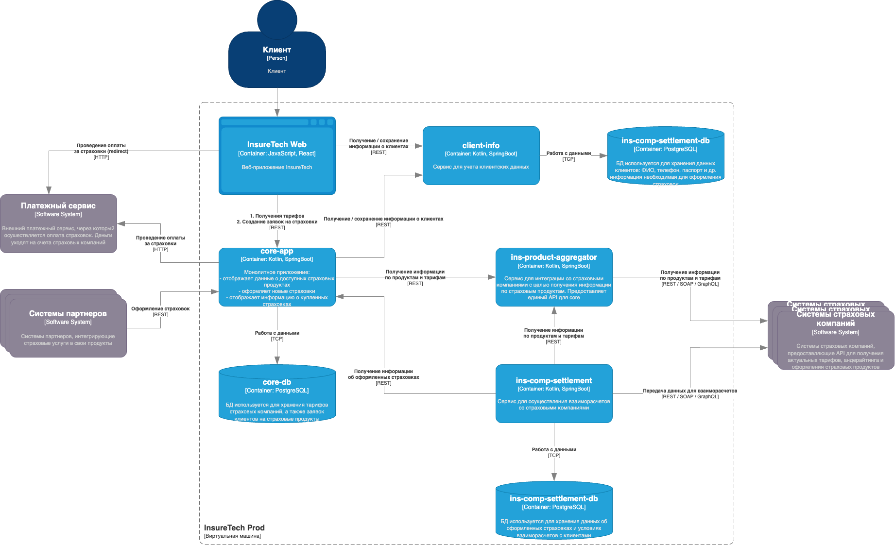

# Легенда

Компания InsureTech предоставляет агрегационные услуги в сфере страхования. 

Она работает с частными и корпоративными клиентами:

- частным клиентам компания предлагает удобный сайт для подбора и оформления страховок,
- корпоративным клиентам и партнёрам предоставляет API для интеграции страховых услуг в их продукты.

Основной продукт InsureTech — это страхование жизни.

## Текущее решение

**core-app** — монолитное бэкенд-приложение. Оно отвечает за отображение доступных клиенту продуктов, оформление заявок на новые страховки и отображение уже оформленных.

**client-info** — сервис управления клиентскими данными. Он передаёт данные core-app для оформления страховок. Если пользователя нет в базе данных или его данные изменились, в процессе оформления страховки сервис 
client-info вносит данные в базу. Он же отвечает за отображение и редактирование клиентских данных в личном кабинете.

**ins-product-aggregator** — сервис интеграции со страховыми компаниями для получения информации о продуктах. Ещё он запрашивает у разных партнёров предложения по ОСАГО для конкретного автомобиля. Сервис предоставляет единый API, агрегируя данные от всех страховых компаний.

 **ins-comp-settlement** — сервис взаиморасчётов со страховыми компаниями. Раз в месяц он отправляет перечень оформленных страховок в страховые компании для расчёта выплаты агентских премий.

**Веб-приложение** для клиентов сервиса.

Описание решения: 

1. Платформа для автоматизации развертывания: Kubernetes с 1 зоной доступности
2. База данных:  PostgreSQL, каждый сервис, использующий БД, имеет отдельную схему данных. БД развёрнута на отдельной ВМ в единственном экземпляре
3. Взаимодействие Frontend-Backend: REST
4. API предоставляет партнёрам доступ напрямую через LoadBalancer Kubernetes, который доступен в сети Интернет
5. Backend интегрирован с пятью страховыми компаниями

Диаграмма контейнеров приложения в модели C4: 

На текущий момент сервис хранит ограниченный набор данных, который включает в себя:

    базовую информацию о клиентах — ФИО, контакты, документы,
    информацию о продуктах и тарифах,
    историю заявок клиентов.

Общий объём данных, которые хранятся в системе, равен 50 GB.

## Требования

1. Recovery Time Objective — не более 45 мин на восстановление.
2. Recovery Point Objective — потеря данных не более чем за 15 мин времени работы. 
3. Доступность приложения должна быть равна 99,9%.
4. Одинаковое время загрузки страниц для пользователей из разных регионов. Оно не должно зависеть от географического местоположения пользователя.
5. Работа из всех часовых поясов.

## Проблемы компании

1. Сайт медленно загружает страницы. Когда нагрузка на приложение повышается, пользователи массово жалуются на то, что страницы грузятся по несколько минут или не загружаются вообще. При этом максимально зафиксированная нагрузка на запросы поиска составила 50 RPS, а на запросы оформления — 10 RPS. Такое положение дел плохо влияет на показатели NPS и retention.

2. Нарушается SLA для B2B-клиентов. Менеджеры уже неоднократно получали сообщения от партнёров, что SLA API не соответствует заявленному. В ходе изучения таких инцидентов выяснилось, что в эти периоды количество запросов от одного из партнёров кратно возрастало. Оно достигало суммарно 250 RPS на все вызываемые операции. По сути, один из партнёров «сжирал» все ресурсы приложения. С этим партнёром изначально договорились, что нагрузка не будет превышать 20 RPS.

3. Приложение падает. InsureTech несколько раз столкнулась с проблемой недоступности приложения. Команда реагировала на проблему очень медленно, поскольку узнавала о ней от пользователей. Каждый час простоя сервис несёт финансовые убытки — примерно 500 тысяч рублей. Также бизнес несёт репутационные потери: в СМИ выходят негативные публикации, у сервиса низкие показатели удовлетворённости пользователей, а некоторые партнёры уже заявили о нежелании продлевать сотрудничество.

[Cхема в технологической архитектуры as-is](./Resource/InsureTech_технологическая_архитектура-as-is.drawio.xml)

# Задание 1. Проектирование технологической архитектуры

## Cтратегия масштабирования

1. **Kubernetes Horizontal Pod Autoscaler (HPA)** - повышаем надежность, платим только за используемые ресурсы (экономия), подходит для облачных сред
2. **Геомасштабирование** - повышаем доступность, масштабируем по регионам

( Делаем допущение о том что все наши Backend сервисы - stateless )

К вертикальному масштабированию мы всегда можем прибегнуть по необходимости, оно имеет ограничения, неплохо подходит, порой как единственный вариант для stateful сервисов, баз данных и т.д. мониторинг нам дал бы польше понимания необходимости, плюс данный подход к масштабированию не позволяет удовлетворить предъявленные требования к надежности, в нашем случае с учетом допущения, и подход к HPA ввиду уже наличия Kubernetes, а также геомасштабирования полностью удовлетворяет предъявленным требованиям.

## Зоны безопасности

Нам требуется иметь несколько зон безопасности по разным ЦОД, в разных городах, задача которую в первую очередь мы должны решить таким шагом, это повышение доступности, в дополнение к повышению отказоустойчивости сервисов InsureTech. 

## Конфигурация Kubernetes

Используем независимые кластеры в каждом ЦОД в разных зонах доступности - что повышает общую надежноть и доступность сервисов InsureTech

## Описание подхода к балансировке нагрузки

Для балансировки нагрузки прибегнем к GSLB (Global Server Load Balancer) входящий в состав DNS позволит отправлять клиентов к наиболее доступным ресурсам (в нашем случае доступность определяется территориальным расположением ЦОД), а Active Monitoring позволит защититься от сбоев и недоступности конкретного ЦОДа тем самым повысит надежность InsureTech в целом.

## Описание фейловер-стратегии

Применяем стратегию **Active-Active**

Active-Active обеспечивает высокие показатели отказоустойчивости и доступности за счет одновременной работы нескольких активных ресурсов, это позволяет системе оставаться доступной даже при выходе из строя одного или нескольких узлов. Совместно с географической избыточностью которая повышает устойчивость системы к локальным сбоям данная стратегия обеспечи нам выполнение предъявленных требований к доступности. 

Применяя данную стратегию мы также получаем повышенную производительность, которую сможем обеспечить за счет эффективной работы с трафиком, распределяя его между активными узлами, и хорошую масштабируемость, которая позволит добиваться предъявленных к системе требований путем добавления активных ресурсов без существенных сбоев в работе.

## Шардирование БД

Принципиально на данный момент нет смысла применять шардирование, во первых, это усложнит архитектуру и затраты на ее реализацию и поддержку, во вторых, данных не так много, и нет явных триггеров для организации шардирования БД, более того, у нас не будет блоккеров, а значит в перспективе мы всегда сможем прибегнуть к шардированию данных по Регионам если потребуется (например в зависимости от числа пользователей).

Подробные детали на: [Cхема в технологической архитектуры to_be](./Task1/InureTech_технологическая%20архитектура_to-be.drawio)

# Задание 2. Динамическое масштабирование контейнеров

Результаты выполнения работы: [скриншот](./Task2/screen/2025-05-05_11-41.png)
Артефакты: ./Task2

# Задание 3. Переход на Event-Driven архитектуру

# Задание 4. Проектирование продажи ОСАГО

# Задание 5. Проектирование GraphQL API

# Задание 6. Настройка Rate Limiting

Артефакты: ./Task2